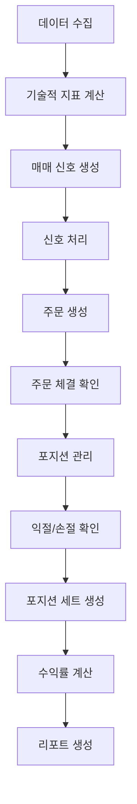
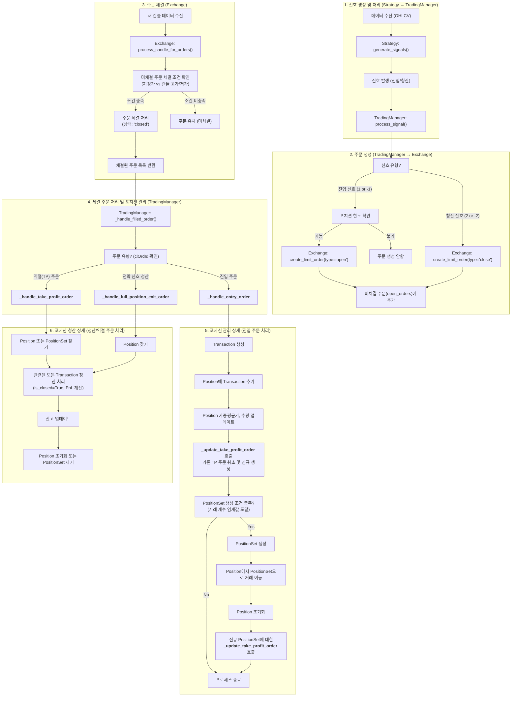

## 1. 프로젝트 개요

CryptoSim은 암호화폐 선물 거래를 위한 백테스팅 및 실시간 거래 시스템입니다. SMA(Simple Moving Average) 크로스오버 전략을 기반으로 하며, 포지션 세트 관리와 리스크 관리 기능을 포함합니다.

### 1.0 사전 과제 진행 내역 
#### 1.0.1 백테스트 시뮬레이터 개발
- 과제명 : cryptoTrader 
- 기간 : 2025.05.01 ~ 2025.06.24
- 주요 구현 내역
  - BIT코인 선물 시간봉 가져오기 
  - 전략 적용을 통한 백테스트  
  - 결과 파일 엑셀 저장을 통한 검증
  - 거래 및 성과 시각화
  
    - 매도/매수 익절/손절 표현
    - 포지션 현황 표현
    - 거래잔고 / 자산평가 구현

    
    - 상세 내역 확인을 위한 Web상 그래프 구현 ( 축소 확대을 통한 테이터 확인 )
- Coworker : Github Co-pilot / VSCode 
- 문제점 
  - 단일 파일 구조 
  - 실제 거래 구현을 위한 고려사항이 미비하여 백테스트 용으로만 활용

#### 1.0.2 1차 구조화 시도
- 과제명 : cryptoBot
- 기간 : 2025.06.26 ~ 2025.07.01
- 주요 구현 내역
  - AI를 통한 PRD 생성 / 진행 일정계획 수립
  - 구조화 방안 수립    
- Coworker : Cursor AI
- 문제점 
  - 구조화 단계에서 고민 없이 AI 내용을 그대로 따라감 
  - 초기에 잘 시작되는 듯 했으나 3-4일 지산 시점 부터 복잡해는 로직과 이전 프로젝트에서 확보되었던 정합성 이슈가 발생하여 결국 중단 


### 1.1 개발 기간 및 진행 내역 (1단계)

#### 전체 개발 기간: 2025년 07월 01 ~ 2025년 7월 15일 (15)

#### 주요 개발 단계별 진행 내역:

**Phase 1: 초기 설계 및 기본 구조 **
- 프로젝트 초기 설정 및 기본 아키텍처 설계
- 핵심 모듈 구조 정의

**Phase 2: 핵심 기능 구현 **
- `b4dd54d` - Initial commit: CryptoSim v2.1 백테스팅 시스템
- Look-ahead bias 해결 및 로직 개선 완료
- 기본 백테스팅 엔진 구현

**Phase 3: PositionSet 개념 도입 **
- `f2a4b60` - PositionSet 클래스 개념 도입 및 백테스트 규칙 구체화
- 포지션 세트 관리 시스템 구현

**Phase 4: 백테스트 정합성 개선 **
- `d40241f` - 백테스팅 정합성 개선 및 PnL 계산 오류 수정
- `a17b7f6` - PositionSet 관리 및 실시간 리포팅 통합

**Phase 5: 거래 로직 최적화 **
- `47392ba` - 익절 및 포지션 관리 로직 개선
- `2f153a8` - 백테스트 정합성 개선 및 신규 파일 추가

**Phase 6: PnL 계산 정확도 향상 **
- `9f486d4` - PnL and average price calculation for crypto margin trading
- `0137e70` - 미실현 손익 오차 수정 및 관련 모듈 업데이트

**Phase 7: 최종 최적화 및 안정화 **
- `a27c993` - 백테스트 로그 추적 제외 및 기타 변경사항 반영
- 시스템 안정성 향상 및 성능 최적화

### 1.2 최근 백테스트 결과 요약 (2025년 7월 15일)

#### 테스트 환경
- **거래 기간**: 2025-01-01 ~ 2025-02-01 (1개월)
- **거래 심볼**: BTC/USD:BTC
- **초기 자본**: 0.5 BTC
- **레버리지**: 5배
- **포지션 크기**: 0.01 BTC
- **익절 비율**: 2%

#### 백테스트 실행 결과
- **총 데이터**: 1,464개 캔들 (전체 데이터)
- **백테스트 데이터**: 744개 캔들 (실제 거래 기간)
- **전략 설정**: SMA 24/720 크로스오버
- **포지션 세트 크기**: 10개 거래
- **최대 롱 세트**: 3개, **최대 숏 세트**: 2개

#### 주요 특징
- **Look-ahead bias 해결**: 전체 데이터로 지표 계산, 필터링된 데이터로 백테스트 실행
- **포지션 세트 관리**: 10개 거래마다 독립적인 포지션 세트 생성
- **실시간 익절 관리**: 각 포지션/세트별 개별 익절 주문 관리
- **다중 거래 모드 지원**: Crypto-Margined (인버스 계약) 모드 사용

### 1.3 주요 특징
- **SMA 크로스오버 전략**: 단기/장기 이동평균선의 교차를 이용한 매매 신호 생성
- **포지션 세트 관리**: 여러 거래를 그룹화하여 독립적으로 관리
- **다중 거래 모드 지원**: USDT-Margined, USDC-Margined, Crypto-Margined
- **실시간/백테스트 모드**: 실제 거래와 백테스팅 모두 지원

## 2. 시스템 아키텍처

### 2.1 핵심 모듈 구조
```
cryptoSim/
├── src/
│   ├── main.py              # 메인 실행 파일
│   ├── strategy.py          # 거래 전략 (SMA 크로스오버)
│   ├── trading_manager.py   # 거래 관리 (신호 처리, 주문 관리)
│   ├── trade_analyzer.py    # 거래 분석 및 백테스트 엔진
│   ├── models.py            # 데이터 모델 (Transaction, Position, PositionSet)
│   ├── exchange.py          # 거래소 인터페이스
│   ├── virtual_exchange.py  # 가상 거래소 (백테스트용)
│   ├── data_fetcher.py      # 데이터 수집
│   └── config_manager.py    # 설정 관리
├── config/
│   └── config.yaml          # 설정 파일
└── logs/                    # 로그 및 리포트 출력
```

### 2.2 데이터 모델
- **Transaction**: 개별 거래 (진입/청산 쌍)
- **Position**: 같은 방향의 거래들 집계
- **PositionSet**: 분리되어 독립 관리되는 포지션 세트

## 3. 거래 프로세스 상세 분석

### 3.1 전체 거래 플로우





### 3.2 신호 생성 프로세스 (SMA 크로스오버)

#### 3.2.1 기술적 지표 계산
```python
# 이동평균선 계산
df[f'sma_{short_period}'] = df['close'].rolling(window=short_period).mean()
df[f'sma_{long_period}'] = df['close'].rolling(window=long_period).mean()

# 크로스오버 감지
df['golden_cross_signal'] = (단기SMA > 장기SMA) & (이전단기SMA <= 이전장기SMA)
df['dead_cross_signal'] = (단기SMA < 장기SMA) & (이전단기SMA >= 이전장기SMA)
```

#### 3.2.2 매매 신호 조건
- **롱 진입 조건**: 
  - 정배열 (단기SMA > 장기SMA)
  - 장기 이평선 상승
  - 가격 하락 (반등 기대)
  
- **숏 진입 조건**:
  - 역배열 (단기SMA < 장기SMA)
  - 장기 이평선 하락
  - 가격 상승 (하락 기대)

### 3.3 신호 생성 및 처리 프로세스

#### 3.3.1 신호 생성 (Strategy)
```python
def generate_signals(self, df: pd.DataFrame) -> pd.DataFrame:
    """거래 신호 생성"""
    df = self.calculate_indicators(df)
    
    # 신호 초기화
    df['signal'] = 0  # 0: 신호없음, 1: 롱, -1: 숏
    df['signal_type'] = 'none'

    # 롱 진입 조건: 상승 추세(정배열) + 장기 이평선 상승 + 가격 하락
    long_entry_condition = (
        df['golden_cross'] &
        df['long_sma_trend'] &
        df['price_decline']
    )

    # 숏 진입 조건: 하락 추세(역배열) + 장기 이평선 하락 + 가격 상승
    short_entry_condition = (
        df['dead_cross'] &
        (~df['long_sma_trend']) &
        df['price_increase']
    )

    df['signal'] = np.where(long_entry_condition, 1, 0)
    df['signal'] = np.where(short_entry_condition, -1, df['signal'])
    
    return df
```

#### 3.3.2 신호 처리 (TradingManager)
```python
def process_signal(self, signal_data: Dict):
    signal = signal_data.get('signal', 0)
    
    if signal == 1:  # 롱 진입
        # 포지션 세트 한도 확인
        if len(self.long_position_sets) >= self.max_long_sets:
            return
        # 주문 생성
        order = self.exchange.create_limit_order(...)
        
    elif signal == -1:  # 숏 진입
        # 숏 포지션 세트 한도 확인
        if len(self.short_position_sets) >= self.max_short_sets:
            return
        # 주문 생성
        order = self.exchange.create_limit_order(...)
```

#### 3.3.3 포지션 세트 관리
- **세트 생성 조건**: 특정 개수의 거래가 누적되면 자동으로 포지션 세트 생성
- **세트 크기**: `position_set_size` (기본값: 10개 거래)
- **최대 세트 수**: 
  - 롱: `max_long_set` (기본값: 3개)
  - 숏: `max_short_set` (기본값: 2개)

#### 3.3.4 익절 관리
```python
def _update_take_profit_order(self, position_or_set, timestamp: datetime):
    # 익절 가격 계산
    if side == PositionSide.LONG:
        exit_price = avg_price * (1 + take_profit_pct)
    else:  # SHORT
        exit_price = avg_price * (1 - take_profit_pct)
    
    # 익절 주문 생성
    tp_order = self.exchange.create_limit_order(...)
```

### 3.4 손익 계산 (PnL)

#### 3.4.1 USDT/USDC-Margined (선형 계약)
```python
# 롱 포지션
pnl = amount * entry_price * (current_price - entry_price) / current_price

# 숏 포지션  
pnl = amount * entry_price * (entry_price - current_price) / current_price
```

#### 3.4.2 Crypto-Margined (인버스 계약)
```python
# 롱 포지션
pnl = amount * entry_price * (1/entry_price - 1/current_price)

# 숏 포지션
pnl = amount * entry_price * (1/current_price - 1/entry_price)
```

## 4. 백테스트 프로세스

### 4.1 백테스트 실행 흐름
1. **데이터 준비**: 전체 데이터에서 기술적 지표 계산
2. **신호 생성**: 전체 데이터 기반으로 신호 생성
3. **백테스트 실행**: 필터링된 데이터로 실제 거래 시뮬레이션
4. **결과 분석**: 수익률, 승률, 최대 낙폭 등 계산
5. **리포트 생성**: Excel 형태로 상세 결과 출력

### 4.2 성능 지표
- **총 수익률**: 전체 거래 기간의 수익률
- **연간 수익률**: 연율화된 수익률
- **승률**: 수익 거래 / 전체 거래
- **최대 낙폭**: 최대 손실 구간의 낙폭
- **샤프 비율**: 위험 대비 수익률

## 5. 설정 관리

### 5.1 주요 설정 항목
```yaml
# 거래 설정
trading:
  symbol: "BTC/USD:BTC"
  position_size: 0.01  # BTC 수량
  leverage: 5          # 레버리지
  take_profit_pct: 0.02  # 2% 익절

# 포지션 세트 설정  
position_set:
  position_set_size: 10   # 세트당 거래 수
  max_long_set: 3         # 최대 롱 세트 수
  max_short_set: 2        # 최대 숏 세트 수

# 전략 설정
strategy:
  simple_ma:
    short_period: 24      # 단기 이동평균
    long_period: 720      # 장기 이동평균
```

### 5.2 거래 모드 설정
- **trade_type: 1**: USDT-Margined (선형 계약)
- **trade_type: 2**: USDC-Margined (선형 계약)  
- **trade_type: 3**: Crypto-Margined (인버스 계약)

## 6. 리스크 관리

### 6.1 포지션 한도 관리
- **최대 동시 포지션 수**: 5개
- **일일 손실 한도**: 5% (daily_loss_limit_pct)
- **포지션 세트 한도**: 롱 3개, 숏 2개

### 6.2 손절 관리
- **손절 비율**: 100% (사실상 비활성화)
- **익절 비율**: 2% (take_profit_pct)
- **미체결 주문 자동 취소**: 1시간 (order_cancel_timeout)

## 7. 로깅 및 결과 확인 

### 7.1 로그 레벨
- **DEBUG**: 상세 디버깅 정보
- **INFO**: 일반 정보 (거래 실행, 신호 생성 등)
- **WARNING**: 경고 (한도 초과, 데이터 부족 등)
- **ERROR**: 오류 (API 오류, 설정 오류 등)

### 7.2 결과 확인 
- OHLC 및 주문 및 거래 내역 포지션 및 자산 정보를 봉단위 산정
- 해당 정보를 엑셀(.xlsx) 포멧으로 저장하여 자체 정합성 확인 

## 8. 결론

CryptoSim은 선물거래 기반 암포화폐  트레이딩 시스템으로, 주문, 거래, 포지션, 전략 등을 실시간 확장을 고려하여 설계되었으며, 특정 전략을 기반으로 벡테스트 정합성 테스트를 완료하여 이것을 1차 단계로 프리징합합니다. 
 
### 주요 장점
- **모듈화된 구조**: 각 기능이 독립적으로 관리되어 유지보수 용이
- **포지션 세트 관리**: 리스크 분산과 수익률 최적화
- **다중 거래 모드**: USDC/USDT/Crypto Margin
- **상세한 백테스트**: 전략 검증을 위한 종합적인 분석 도구


## 9. 확장성 및 개선 방향

### 9.1 전략 확장
- 다양한 기술적 지표 추가 (RSI, MACD, 볼린저 밴드 등)
- 머신러닝 기반 신호 생성
- 멀티 타임프레임 분석

### 9.2 리스크 관리 강화
- 동적 포지션 사이징
- 변동성 기반 손절
- 상관관계 분석을 통한 포트폴리오 최적화

### 9.3 모니터링 기능 추가
- 실시간 포지션 상태
- 미체결 주문 현황
- 수익률 추이
- 포지션 세트 생성/해제

### 9.4 성능 최적화
- 데이터베이스 캐싱
- 병렬 처리
- 실시간 데이터 스트리밍


## 10. 향후 계획
